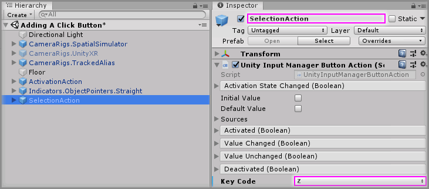
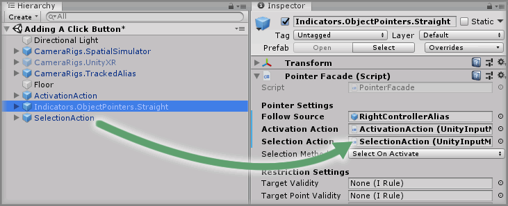
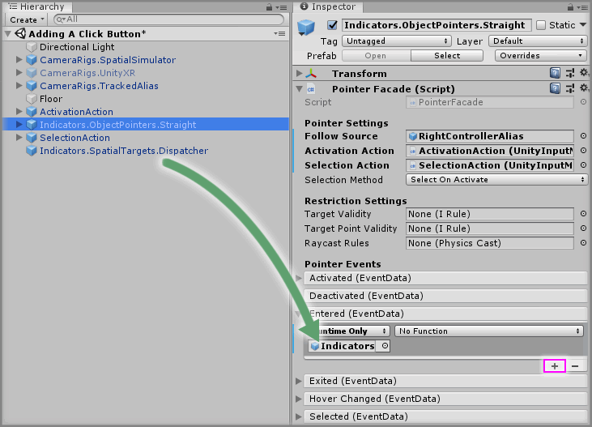
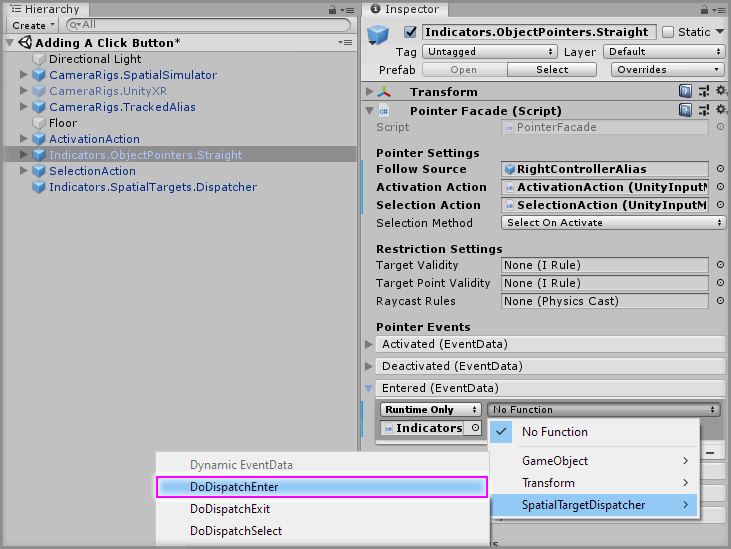
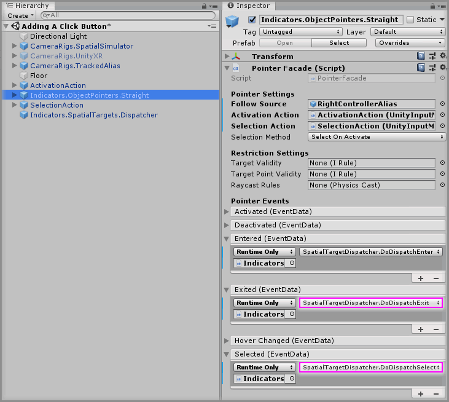
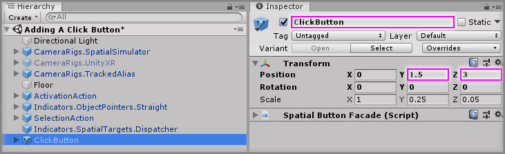
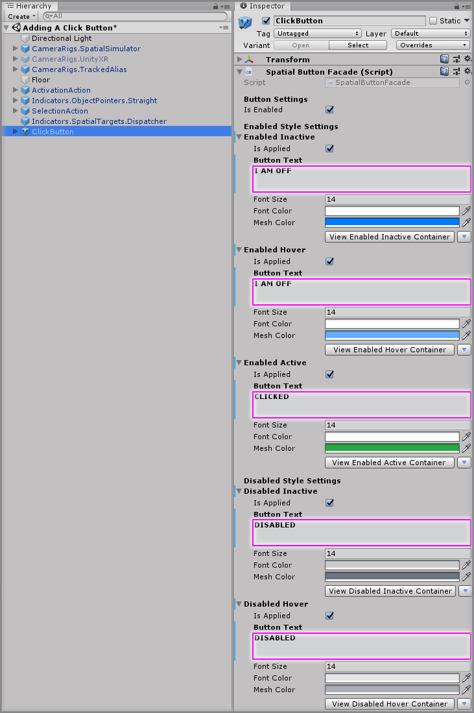
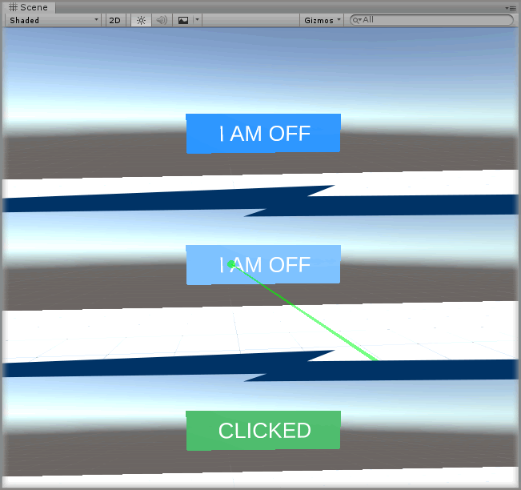

# Adding A Click Button

> * Level: Beginner
>
> * Reading Time: 10 minutes
>
> * Checked with: Unity 2018.3.14f1

## Introduction

Creating 3D user interfaces in spatial computing can be achieved by using collidable 3D objects that can be interacted with via Interactors or Pointers. We're going to set up a simple button that can be selected with an Object Pointer to initiate the click of the button using the `Interactions.SpatialButton.ClickButton` prefab to represent our button and the `Indicators.ObjectPointers.Straight` prefab for our spatial pointer that can interact with the button.

## Prerequisites

* [Add the Tilia.Indicators.ObjectPointers.Unity -> Indicators.ObjectPointers.Straight] prefab to the scene hierarchy.
* [Install the Tilia.Indicators.SpatialTargets.Unity] package dependency in to your [Unity] project.

## Let's Start

### Step 1

We're going to start by extending our Object Pointer and giving it a selection action as the [Adding A Straight Pointer] guide only sets up the activation action for the pointer.

Select the `Input.UnityInputManager.ButtonAction` from the Unity Hierarchy window and duplicate this GameObject by right clicking on the `Input.UnityInputManager.ButtonAction` GameObject and selecting `Duplicate` from the context menu.

Rename the duplicated `Input.UnityInputManager.ButtonAction (1)` to `SelectionAction`.

> You can rename the `Input.UnityInputManager.ButtonAction` GameObject to `ActivationAction` too if you wish.

Select the `SelectionAction` GameObject from the Unity Hierarchy window and on the `Unity Input Manager Button Action` component change the `Key Code` property value to `Z`.

### Step 2

Drag and drop the `SelectionAction` GameObject into the `Selection Action` property on the `Pointer Facade` component within the `Indicators.ObjectPointers.Straight` GameObject.

### Step 3

We need to now set up some glue between our Object Pointer and our Spatial Button. We don't want to have our Object Pointer have to know about every single Spatial Button in the scene as there could be many and it would be a pain to maintain all of these links.

We can use the `Indicators.SpatialTargets.Dispatcher` prefab, which acts as a separation layer for our Spatial Buttons. Our Object Pointer only needs to know about our Dispatcher and our Dispatcher knows about our Spatial Buttons. This means for any communication between our Object Pointer and our Spatial Buttons will go through a Dispatcher.

Add a `Indicators.SpatialTargets.Dispatcher` prefab to the Unity project hierarchy by selecting `GameObject -> Tilia -> Prefabs -> Indicators -> SpatialTargets -> Indicators.SpatialTargets.Dispatcher` from the Unity main top menu.

### Step 4

We now need to hook our Object Pointer up to our Dispatcher so the `Enter`, `Exit` and `Select` events of our Object Pointer call the relevant methods on our Dispatcher.

Select the `Indicators.ObjectPointers.Straight` GameObject from the Unity Hierarchy window and click the `+` symbol in the bottom right corner of the `Entered` event parameter on the `Pointer Facade` component.

Drag and drop the `Indicators.SpatialTargets.Dispatcher` GameObject into the event listener box that appears on the `Entered` event parameter on the `Pointer Facade` component that displays `None (Object)`.

Select a function to perform when the `Entered` event is emitted. For this example, select the `SpatialTargetDispatcher -> DoDispatchEnter` function (be sure to select `Dynamic EventData - DoDispatchEnter` for this example).

### Step 5

Do the same as [Step 4] but for the `Exited` and `Selected` event parameters on the `Pointer Facade` component, choose the appropriate function to be called:

* Exited: `SpatialTargetDispatcher -> DoDispatchExit`
* Selected: `SpatialTargetDispatcher -> DoDispatchSelect`

### Step 6

We now have a Spatial Target Dispatcher in our scene all set up to accept events from our Object Pointer and dispatch the appropriate method to whatever Spatial Target is in the scene. We can now add a Spatial Button to our scene to create our simple click button.

Add a `Interactions.SpatialButton.ClickButton` prefab to the Unity project hierarchy by selecting `GameObject -> Tilia -> Prefabs -> Interactions -> SpatialButtons -> Interactions.SpatialButton.ClickButton` from the Unity main top menu.

### Step 7

Select the `Interactions.SpatialButton.ClickButton` GameObject in the Unity Hierarchy window and change the Transform Properties to:

* Position: `X = 0, Y = 1.5, Z = 3`

Rename the `Interactions.SpatialButton.ClickButton` GameObject to `ClickButton`.

> If you wish to resize your button then you can simply change the scale on this Transform to the desired size.

### Step 8

We can now change the appearance of our Spatial Button by editing the Style properties on the `Spatial Button Facade` component.

There are two main states a button can be in, with relevant nested sub-states:

* **Enabled Styles**: These are the styles used for the button appearance when the button is enabled (`Is Enabled` property is checked).
  * **Enabled Inactive**: The button is enabled but it is not being hovered over therefore it is in an inactive state.
  * **Enabled Hover**: The button is enabled and the Object Pointer is hovering over this button but the button has not been selected.
  * **Enabled Active**: The button is enabled and the Object Pointer has activated the button (i.e. clicked the button).
* **Disabled Styles**: These are the styles used for the button appearance when the button is disabled (`Is Enabled` property is unchecked).
  * **Disabled Inactive**: The button is disabled but it is not being hovered over therefore it is in an inactive state.
  * **Disabled Hover**: The button is disabled and the Object Pointer is hovering over this button but the button has not been selected.

Each Style type is a collection of properties that relate to the state of the button, the nested property types of a style are:

* `Is Applied`: Whether to apply the style to the button state. If this is unchecked then you can manually style the internal elements of the button.
* `Button Text`: The text to display on the button when the button is in the related state.
* `Font Size`: The size of the font for the text to be displayed in.
* `Font Color`: The color of the font for the text.
* `Mesh Color`: The color of the button mesh box for when the button is in the related state.

We're just going to set up a simple button for now where we're just going to change the text for each state but leave the appearance of the button as the default settings.

Select the `ClickButton` GameObject from the Unity Hierarchy window and on the `Spatial Button Facade` component change the following properties:

* Enabled Inactive -> Button Text: `I AM OFF`
* Enabled Hover -> Button Text: `I AM OFF`
* Enabled Active -> Button Text: `CLICKED`
* Disabled Inactive -> Button Text: `DISABLED`
* Disabled Hover -> Button Text: `DISABLED`

### Done

Play the Unity scene and press the `Space` key to activate the Object Pointer, point the beam at the button and notice how the button mesh color changes to the hover color. Press the `Z` key to call the Object Pointer selection action, which in turn will click our button and you'll see the button change quickly to the activated state before returning to the default state.

[Add the Tilia.Indicators.ObjectPointers.Unity -> Indicators.ObjectPointers.Straight]: https://github.com/ExtendRealityLtd/Tilia.Indicators.ObjectPointers.Unity/blob/master/Documentation/HowToGuides/AddingAStraightPointer/README.md
[Install the Tilia.Indicators.SpatialTargets.Unity]: ../Installation/README.md
[Unity]: https://unity3d.com/
[Adding A Straight Pointer]: https://github.com/ExtendRealityLtd/Tilia.Indicators.ObjectPointers.Unity/blob/master/Documentation/HowToGuides/AddingAStraightPointer/README.md
[Step 4]: #Step-4