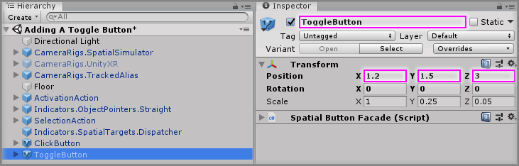
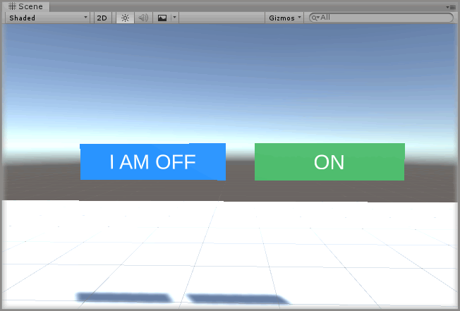
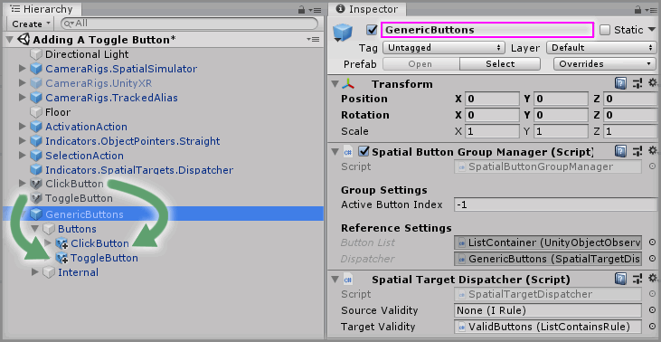
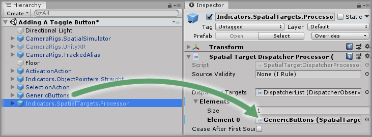
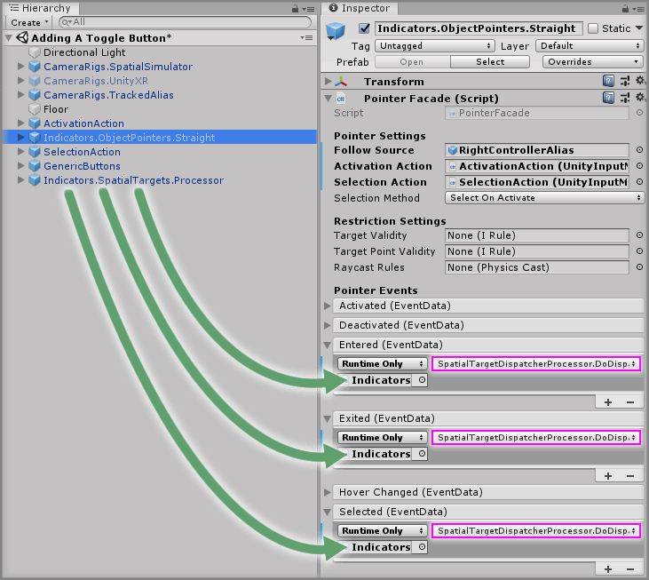

# Adding A Toggle Button

> * Level: Beginner
>
> * Reading Time: 5 minutes
>
> * Checked with: Unity 2018.3.14f1

## Introduction

A Toggle Button is another way of providing a simple spatial UI option where the button holds its state until it is clicked again. This allows for a situation where the button is either in an activated `on` state or a deactivated `off` state with each state being toggled by clicking on the button with an Object Pointer.

The `Interactions.SpatialButton.ToggleButton` prefab makes it very easy to set up a Toggle Button.

## Prerequisites

* [Add the Tilia.Interactions.SpatialButtons.Unity -> Interactions.SpatialButton.ClickButton] prefab to the scene hierarchy.

## Let's Start

### Step 1

We already have pretty much everything we need in our scene from the [Adding A Click Button] guide, so all we really need to do is add a `Interactions.SpatialButton.ToggleButton` prefab to the Unity project hierarchy by selecting `GameObject -> Tilia -> Prefabs -> Interactions -> SpatialButtons -> Interactions.SpatialButton.ToggleButton` from the Unity main top menu.

### Step 2

Select the `Interactions.SpatialButton.ToggleButton` GameObject in the Unity Hierarchy window and change the Transform Properties to:

* Position: `X = 1.2, Y = 1.5, Z = 3`

Rename the `Interactions.SpatialButton.ToggleButton` GameObject to `ToggleButton`.

### Step 3

You can now configure the appearance styles of the newly added Toggle Button by following the same instructions in [Step 8 of Adding A Click Button], but for the purposes of this guide we can just leave them as the default styles.

That's pretty much it for adding a Toggle Button, if you now play the Unity scene you'll see that clicking on the Toggle Button with the Object Pointer the first time puts the Toggle Button into the active state and it will stay active until the Toggle Button is clicked again.

### Step 4

We could stop here, but before we do let's explore the concept of Button Groups and what makes them useful.

The `Interactions.SpatialButton.Group` prefab allows us to group together scene Spatial Buttons and each group has its own Spatial Target Dispatcher, meaning we can limit which buttons can control the state of other buttons in other groups and even let us control which Object Pointers can interact with these button groups.

We're not going to delve into the Spatial Target Dispatcher rules in this guide, instead we're just going to put our two scene Spatial Buttons into a Button Group and take a quick look at the Spatial Target Processor.

Let's start by adding a `Interactions.SpatialButton.Group` prefab to the Unity project hierarchy by selecting `GameObject -> Tilia -> Prefabs -> Interactions -> SpatialButtons -> Interactions.SpatialButton.Group` from the Unity main top menu.

### Step 5

Rename the `Interactions.SpatialButton.Group` GameObject to `GenericButtons`

We now just need to move our existing scene Spatial Buttons to be nested within the `GenericButtons -> Buttons` GameObject, so drag and drop the `ClickButton` GameObject to be a child of the `GenericButtons -> Buttons` GameObject and then drag and drop the `ToggleButton` GameObject to be a child of the `GenericButtons -> Buttons` GameObject.

### Step 6

The `Interactions.SpatialButton.Group` prefab already contains a Spatial Target Dispatcher, so the one we've already added to the scene can be deleted. Select the `Indicators.SpatialTargets.Dispatcher` GameObject and press the `Delete` key to remove it from the Unity hierarchy.

Our Object Pointer is no longer set up to work with our buttons now because we've deleted the Spatial Target Dispatcher that we'd hooked it up to in the [Adding A Click Button] guide. We do have the Spatial Target Dispatcher on the Button Group that we could use, but this is going to mean that every new button group we add means we'll need to keep hooking up our Object Pointer events to every Spatial Target Dispatcher for each new Button Group.

This is where the Spatial Target Processor comes in as the Spatial Target Processor is simply a list of Spatial Target Dispatchers and the Processor will pass the data on to each active Dispatcher in the list. This means we can simply set up our Object Pointer once to call the Spatial Target Processor and then any new Spatial Target Dispatcher we add can just be added to the Spatial Target Processor list.

> You can also have multiple Spatial Target Processors in the scene and Spatial Target Processors can also be added to the Spatial Target Processor List as they extend the Spatial Target Dispatcher.

Add a `Indicators.SpatialTargets.Processor` prefab to the Unity project hierarchy by selecting `GameObject -> Tilia -> Prefabs -> Indicators -> SpatialTargets -> Indicators.SpatialTargets.Processor` from the Unity main top menu.

### Step 7

Select the `Indicators.SpatialTargets.Processor` GameObject from the Unity Hierarchy window and drag and drop the `GenericButtons` GameObject into the `Element 0` property value within `Dispatcher Targets` property on the `Spatial Target Dispatcher Processor` component.

### Step 8

We now need to fix our Object Pointer events because previously they would have been set up with event listeners on the Spatial Target Dispatcher that we've just deleted, so now we need to hook up our Object Pointer events to our newly added Spatial Target Processor.

Select the `Indicators.ObjectPointers.Straight` GameObject in the Unity Hierarchy window and you'll see that the `Entered`, `Exited` and `Selected` Pointer Events on the `Pointer Facade` component all say `Missing (Object)` in the event listener boxes. This is because the old Spatial Target Dispatcher cannot be found because it no longer exists.

All we need to do is follow the same instructions outlined in [Step 4 of Adding A Click Button] and [Step 5 of Adding A CLick Button] but instead we'll drag and drop the `Indicators.SpatialTargets.Processor` GameObject into the appropriate event listener boxes.

You'll notice the relevant methods for each event listener are the same on the Spatial Target Processor as they were for the Spatial Target Dispatcher.

### Done

Play the Unity scene and you'll notice the Toggle Button still works the same way so press the `Space` key to activate the Object Pointer and point the beam at the Toggle Button, then press the `Z` key to put the Toggle Button into the activated state. Clicking on the Toggle Button again with the Object Pointer will put the Toggle Button back to the deactivated state.

[Add the Tilia.Interactions.SpatialButtons.Unity -> Interactions.SpatialButton.ClickButton]: ../AddingAClickButton/README.md
[Adding A Click Button]: ../AddingAClickButton/README.md
[Step 8 of Adding A Click Button]: ../AddingAClickButton/README.md#step-8
[Step 4 of Adding A Click Button]: ../AddingAClickButton/README.md#step-4
[Step 5 of Adding A Click Button]: ../AddingAClickButton/README.md#step-5