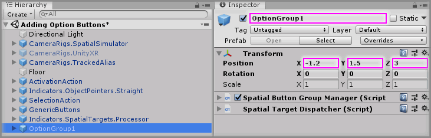

# Adding Option Buttons

> * Level: Beginner
>
> * Reading Time: 5 minutes
>
> * Checked with: Unity 2018.3.14f1

## Introduction

Option Buttons are a way of providing multiple choice options where only one of the buttons can be in the activated state and upon activating another button will ensure all other buttons in the group are deactivated.

We can achieve a simple group of Option Buttons using the `Interactions.SpatialButton.OptionButton` prefab nested within the `Interactions.SpatialButton.Group` prefab.

## Prerequisites

* [Add the Tilia.Interactions.SpatialButtons.Unity -> Interactions.SpatialButton.ToggleButton] prefab to the scene hierarchy.

## Let's Start

### Step 1

Our scene should already have everything set up to dispatch our Object Pointer events to our Spatial Target Processor, so all we need to do to add our Option Button Group is to add another Button Group and fill it with some Option Buttons.

Add a `Interactions.SpatialButton.Group` prefab to the Unity project hierarchy by selecting `GameObject -> Tilia -> Prefabs -> Interactions -> SpatialButton -> Interactions.SpatialButton.Group` from the Unity main top menu.

### Step 2

Select the `Interactions.SpatialButton.Group` GameObject in the Unity Hierarchy window and change the Transform Properties to:

* Position: `X = -1.2, Y = 1.5, Z = 3`

Rename the `Interactions.SpatialButton.Group` GameObject to `OptionGroup1`.

### Step 3

We now have another Spatial Button Group in our scene and this comes with its own Spatial Target Dispatcher. We need to tell our Spatial Target Processor about this new Spatial Target Dispatcher.

Select the `Indicators.SpatialTargets.Processor` GameObject from the Unity Hierarchy window then increase the `Dispatcher Targets -> Elements -> Size` property value by `1` on the `Spatial Target Dispatcher Processor` component.

> The size property will be `1` so change it to `2`.

### Step 4

Drag and drop the `OptionGroup1` GameObject into the newly created `Element 0` property value within `Dispatcher Targets` property on the `Spatial Target Dispatcher Processor` component.

### Step 5

We can now start adding some Option Buttons to our group.

Add a `Interactions.SpatialButton.OptionButton` prefab to the Unity project hierarchy by selecting `GameObject -> Tilia -> Prefabs -> Interactions -> SpatialButtons -> Interactions.SpatialButton.OptionButton` from the Unity main top menu and drag it into being a child of the `OptionGroup1 -> Buttons` GameObject.

### Step 6

Select the `OptionGroup1 -> Buttons -> Interactions.SpatialButton.OptionButton` GameObject in the Unity Hierarchy window and change the Transform Properties to:

* Position: `X = 0, Y = 0.3, Z = 0`

Rename the `Interactions.SpatialButton.OptionButton` GameObject to `Option1`.

Change the following properties in the `Spatial Button Facade` component:

* Enabled Inactive -> Button Text: `OPTION 1`
* Enabled Hover -> Button Text: `OPTION 1`
* Enabled Active -> Button Text: `OPTION 1`
* Disabled Inactive -> Button Text: `OPTION 1`
* Disabled Hover -> Button Text: `OPTION 1`

### Step 7

Create the remaining option buttons by duplicating the `Option1` GameObject two times by right clicking on the `Option1` GameObject and selecting `Duplicate` from the context menu.

For each duplicated GameObject change the following properties:

#### Option1 (1)

Rename the duplicated `Option1 (1)` to `Option2`.

##### Transform

* Position: `X = 0, Y = 0, Z = 0`

##### Spatial Button Facade

* Enabled Inactive -> Button Text: `OPTION 2`
* Enabled Hover -> Button Text: `OPTION 2`
* Enabled Active -> Button Text: `OPTION 2`
* Disabled Inactive -> Button Text: `OPTION 2`
* Disabled Hover -> Button Text: `OPTION 2`

#### Option1 (2)

Rename the duplicated `Option1 (2)` to `Option3`.

##### Transform

* Position: `X = 0, Y = -0.3, Z = 0`

##### Spatial Button Facade

* Enabled Inactive -> Button Text: `OPTION 3`
* Enabled Hover -> Button Text: `OPTION 3`
* Enabled Active -> Button Text: `OPTION 3`
* Disabled Inactive -> Button Text: `OPTION 3`
* Disabled Hover -> Button Text: `OPTION 3`

### Step 8

The last thing we need to do now is just choose which Option Button we want selected by default.

Select the `OptionGroup1` GameObject from the Unity Hierarchy window and on the `Spatial Button Group Manager` component change the `Active Button Index` property value to `0`.

This will mean the first button in our list (index 0) will be activated when our Button Group is enabled. If we wanted our last button to be the intial activated option then we would set this `Active Button Index` property value to `2`.

If you don't want any Option Button selected by default, then you can set the `Active Button Index` property to `-1`.

> The `Active Button Index` property also tells you which button has most recently been activated in the Button Group.

### Done

Play the Unity scene and press the `Space` key to activate the Object Pointer, point the beam at the one of the newly added Option Buttons then press the `Z` key select an Option Button. You'll notice that because these Option Buttons are all in the same Spatial Button Group that only one Option Button can be active.

[Add the Tilia.Interactions.SpatialButtons.Unity -> Interactions.SpatialButton.ToggleButton]: ../AddingAToggleButton/README.md